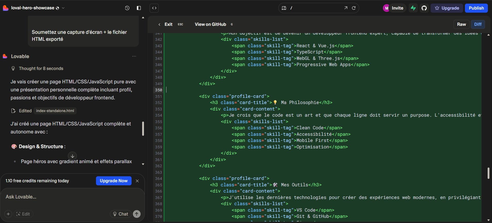
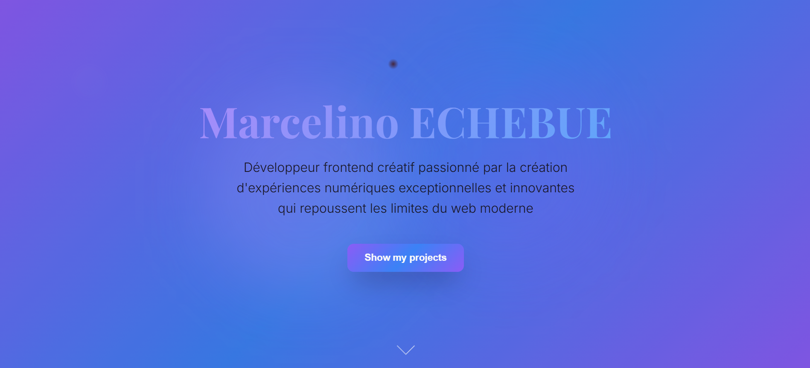
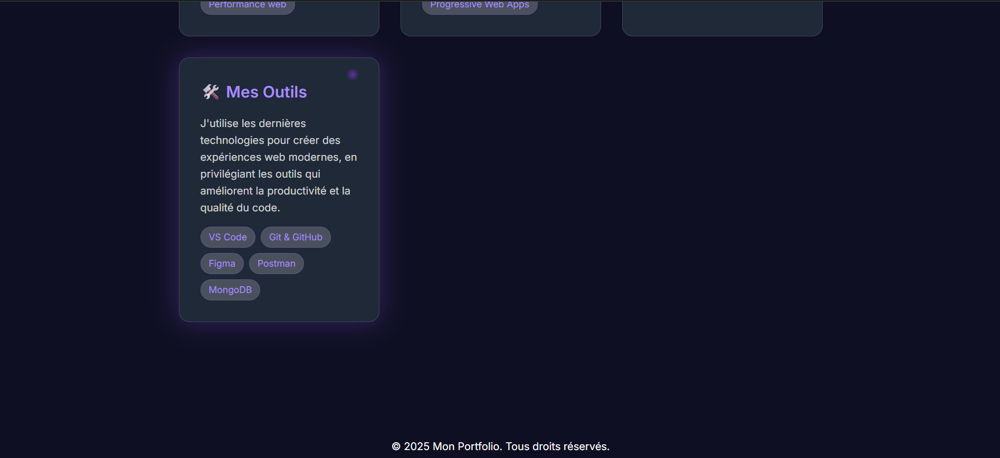

# 🌐 Page d’Introduction Personnelle

Il m’a été demandé de créer une **page d’introduction personnelle** à l’aide d’outils d’IA.  
Cette page présente :  
- 👤 Mon **profil**  
- 💡 Mes **passions**  
- 🎯 Une **brève description** de mon objectif en tant que **développeur frontend**  

L’interface contient un en-tête principal avec mon nom, un sous-titre et un bouton **« Voir mes projets »**.

---

## 📂 Structure du projet

personal-intro-webpage
├── css
│ └── style.css
├── js
│ └── script.js
├── index.html
└── README.md

## 🖼️ Captures d’écran du projet

### 1️⃣ Code généré par l’IA (Lovable)

### 2️⃣ Code affiché dans le navigateur (partie 1)

### 3️⃣ Code affiché dans le navigateur (partie 2)
